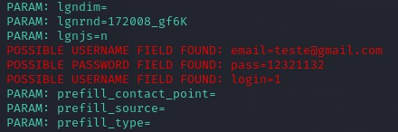

# Phishing para captura de senhas do Facebook
Neste desafio de projeto, iremos criar um Phishing para capturar senhas de login do Facebook.

## <b>Atenção</b>

## Conformidade Legal

<i>Respeito às Leis e Regulamentos</i>: Adote medidas em conformidade com as leis e regulamentos locais sobre segurança da informação e testes de penetração.

## Fins Educacionais e Éticos

<i>Propósito Educativo</i>: Este projeto tem a finalidade exclusiva de ser utilizado para educação e treinamento em segurança da informação. Evite empregar este projeto para atividades maliciosas ou prejudiciais.

### Ferramentas

- Kali Linux
- Setoolkit

### Configurando o Phishing no Kali Linux

- Acesso root: ``` sudo su ```
- Iniciando o setoolkit: ``` setoolkit ```
- Tipo de ataque: ``` Social-Engineering Attacks ```
- Vetor de ataque: ``` Web Site Attack Vectors ```
- Método de ataque: ```Credential Harvester Attack Method ```
- Método de ataque: ``` Site Cloner ```
- Obtendo o endereço da máquina: ``` ifconfig ```
- URL para clone: http://www.facebook.com

### Resutados

